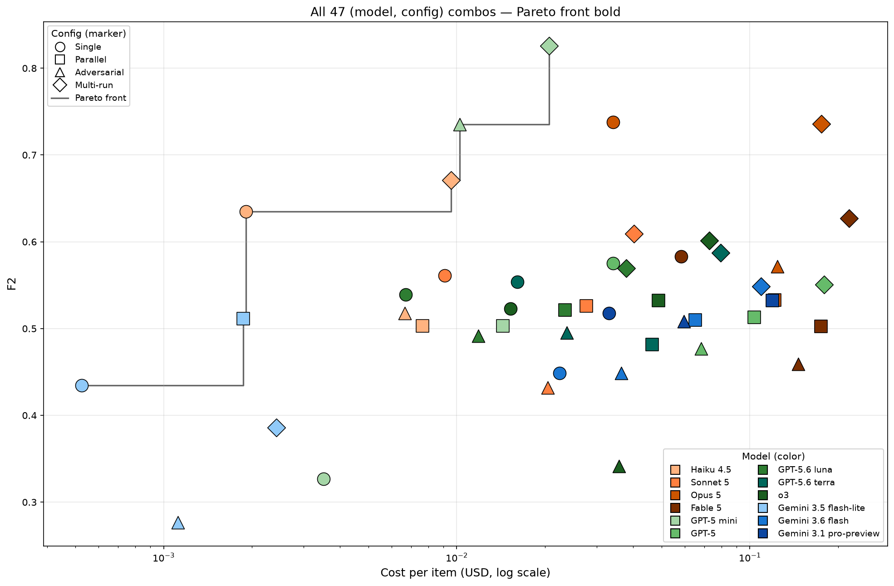

# review-orchestration-bench

AI コードレビュー・オーケストレーション構成 (単一 / 観点別並列 / 反証型 / 反復実行集約) のコストと欠陥検出性能を比較するベンチマーク研究．

A cost-vs-performance benchmark for AI code review orchestration configurations (single, parallel-aspect, adversarial, multi-run aggregation).

## Key Findings (SIG-AGI 33rd, 2026-08)

- **12 モデル × 4 構成 × 30 項目 = 1440 combos** を実測 (総 API 支出 $79.79)．
- **GPT-5 mini + Multi-run** が最良: $F_2 = 0.826$ (95% bootstrap CI $[0.746, 0.903]$), $0.0206/item．
- **Multi-run** が構成別平均 $F_2 = 0.602$ で最高，12 モデル中 8 モデルで最良となる．
- **9 / 12 モデル** がコスト-$F_2$ パレートフロントから外れ，廉価モデル + Multi-run が上位価格帯モデルを上回る．
- **$0.05/item 以上** の予算では，予算を 4 倍に増やしても達成可能な最高 $F_2$ は向上しない．



## Benchmark

- **30 項目**: 4 リポジトリの bug-fix コミット逆適用による合成 PR (レビュー対象 diff + ground truth)．
- **リポジトリ**: fastapi (Python / Web フレームワーク), valibot (TypeScript / スキーマ検証), chi (Go / HTTP ルータ), pgrust (Rust / DB エンジン)．
- **Leakage 統制**: pgrust は 2026-06 以降のコミットで構成され，本稿対象モデルの知識カットオフ後に相当．
- **バグ種別**: logic, type-safety, error-handling, concurrency, security, その他 (8 カテゴリ)．

## Orchestration configurations

| 構成 | 呼び出し回数 | 説明 |
|---|---|---|
| **Single** | 1 | 単一レビュアが全観点を担当． |
| **Parallel** | 4 | 4 観点 (correctness, concurrency, api-misuse, security) を独立実行し和集合を取得． |
| **Adversarial** | $1+2k$ | レビュアの初回 1 回 + 各指摘 $k$ に反証プロンプト 2 回，半数以上の支持で採用． |
| **Multi-run** | 5 | 同一プロンプトを 5 回実行し，2 票以上の指摘のみ採用． |

## Models (12, 3 vendors)

- **Anthropic**: Haiku 4.5, Sonnet 5, Opus 5, Fable 5
- **OpenAI**: GPT-5 mini, GPT-5, GPT-5.6 luna, GPT-5.6 terra, o3
- **Google**: Gemini 3.5 flash-lite, 3.6 flash, 3.1 pro-preview

## Reproducing

```bash
# Install deps
uv sync

# Environment (set in .env)
# ANTHROPIC_API_KEY, OPENAI_API_KEY, GOOGLE_API_KEY, PAPER_EMAIL

# Run experiment (single or comma-separated model/config sets)
uv run scripts/run_experiment.py \
  --run-name my-run \
  --models claude-haiku-4-5,gpt-5-mini \
  --configs single,parallel,adversarial,multi

# Analyze + generate paper tables/plots
uv run scripts/analyze.py --run my-run --save --paper-dir docs/paper/sigagi/
uv run scripts/plot_pareto.py --run my-run --out docs/paper/sigagi/fig/pareto.pdf
uv run scripts/plot_budget.py --run my-run --out docs/paper/sigagi/fig/budget.pdf

# Build paper
./docs/paper/sigagi/build.sh
```

## Repository structure

```
src/harness/            # multi-vendor LLM harness + per-call cost ledger
scripts/                # experiment runner, analysis, plotting
data/mining/            # bug-fix commit mining outputs
data/benchmark/v0/      # 85-item benchmark selection with ground truth
data/experiments/v0/    # results.jsonl and aggregated tables
runs/                   # per-run ledger.jsonl + stdout logs
docs/paper/sigagi/      # JSAI SIG-AGI 33rd shortpaper source
docs/slides/proposal/   # research proposal slides
docs/img/               # README figures
```

## Documents

- [Paper (SIG-AGI 33rd, SIG-AGI-033-07, JP)](./docs/paper/sigagi/main.pdf)
- [Research proposal slides (JP)](./docs/slides/proposal/proposal-slide.pdf)

## Roadmap

- ✅ 2026-08 SIG-AGI 第 33 回 (実験結果の発表)
- 2026-09-12 ベンチマーク拡充 (85 → 全数, カテゴリ均等サンプリング), 意味一致判定器の実装
